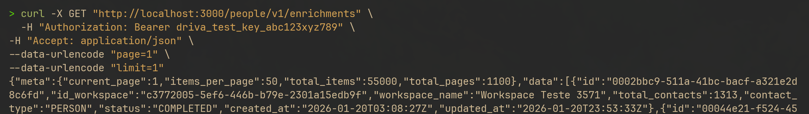
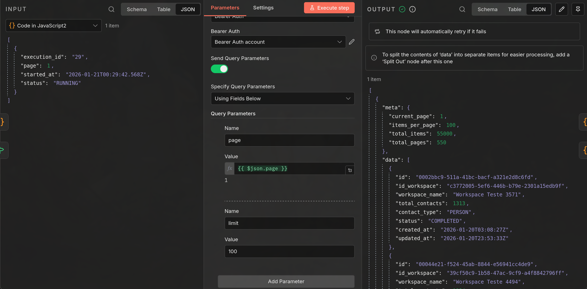
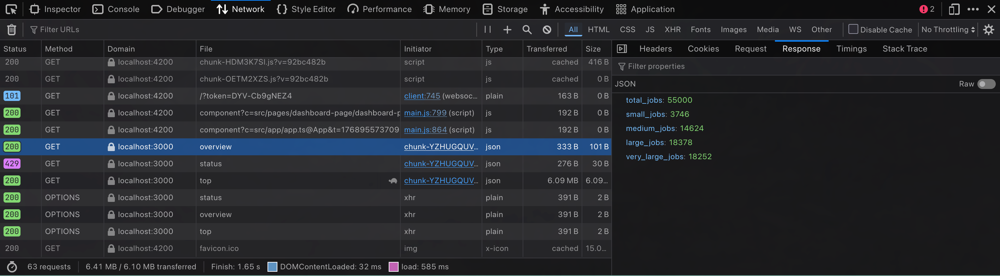
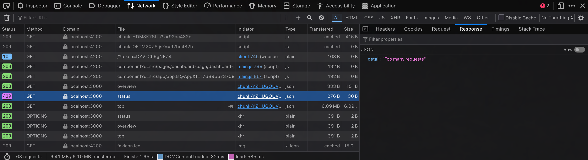
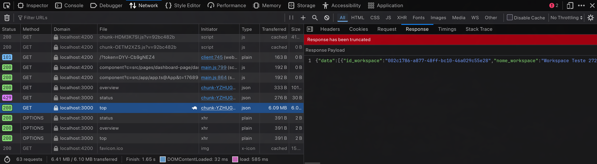
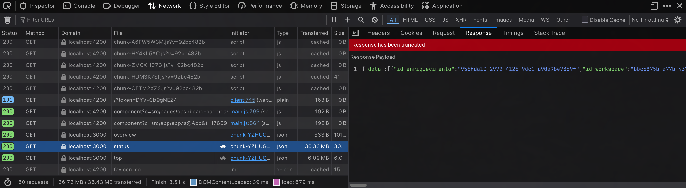

# driva-technical-test

## Visão geral

Este projeto tem como objetivo fornecer uma solução técnica para ingestão, processamento, enriquecimento e visualização de dados, simulando um fluxo completo de ETL com uso de workflows automatizados e dashboard analítico. Destaca-se que o desenvolvimento foi feito em sistema operacional Linux, portanto o guia segue essa premissa.

A aplicação é composta por:
- **Scripts de inicialização**: Criação das tabelas e inserção de dados simulados, prontos para testes e demonstração.
- **API com FastAPI**: Prover acesso aos dados enriquecidos, com filtros por datas, status, workspace, entre outros.
- **Workflows automatizados**: Utilizando n8n para orquestrar tarefas de ingestão, processamento e geração de novos dados.
- **Dashboard Angular**: Interface web para visualização e análise dos dados processados.
- **Utilização de PostgreSQL**: Como base centralizada de dados para todas as etapas do fluxo.

O projeto possibilita a execução ponta a ponta — da ingestão de informações até a apresentação visual dos resultados. A execução está praticamente 100% automatizada, com exceção da definição da credencial do Postgres e da credencial da API (`API_KEY`) no n8n.

Credenciais necessárias:
- `API_KEY`: `driva_test_key_abc123xyz789`
- Postgres:
  - `DB_HOST`: `postgres`
  - `DB_NAME`: `driva-dw`
  - `DB_USR`: `driva`
  - `DB_PSW`: `driva`

## Utilizações de IA no desenvolvimento

- Para otimizar o processo de desenvolvimento e evitar erros sintáticos, o script de inicialização das tabelas em `init.sql` foi produzido com o uso de IA, com apenas alguns ajustes de nomes;
- Também foi utilizada para inserir dados enriquecidos simulados, gerando um script que selecionava aleatoriamente as combinações possíveis;
- Para a produção do YAML, a IA foi utilizada na definição das variáveis de ambiente necessárias para cada serviço;
- Utilizada para mostrar uma forma de persistir os workflows;
- Para a construção do script da API, utilizando FastAPI (primeira experiência);
- Para a tradução do script Python autoral em JS;
- Para a produção do dashboard;
- Ajuda no entendimento da tabela de controle e suas utilidades.

## Execução do projeto

Para executar o projeto, dar `chmod +x init.sh` e depois executar o script.

O dashboard deve ser executado após ou durante o workflow de processamento para possibilitar a visualização dos dados na interface. Para a execução, basta que o usuário execute `init.sh`, que também iniciará os contêineres. Se a execução estiver durante o processamento, é necessário atualizar a página para visualizar os dados mais recentes consumidos. O dashboard é acessado pelo navegador, utilizando a porta 4200.

## Exemplos de chamadas (CURL)


***Requisição feita através do curl, porém a visualização não ficou ideal.***


***Mesma requisição mas agora dentro do n8n, possibilitando melhor visualização.***


***Requisição no endpoint de overview, através do dashboard.***


***Requisição no endpoint de enrichments, recebendo erro: Too many requests.***


***Requisição no endpoint de top, através do dashboard.***


***Requisição no endpoint de enrichments, através do dashboard.***

## Guia pelos diretórios (árvore)

```
.
├── api/                 # API FastAPI e Dockerfile do serviço
├── assets/              # Imagens usadas no README
├── dashboard/           # Front-end Angular
├── workflows/           # Workflows do n8n
├── docker-compose.yml   # Orquestração dos serviços
├── init.sh              # Script de inicialização do ambiente
├── init.sql             # Criação das tabelas e seeds
```
